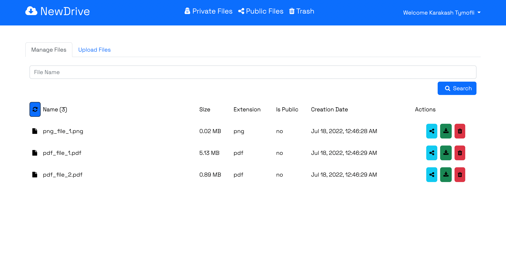
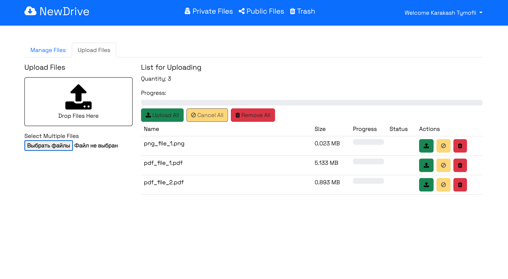

# File Storage - Web Project
## Preview

## Functionality requirements
- Access to a file by a short link.
- Shared and restricted files.
- For registered users - the ability to place files and manage files.
### For special users:
- Managing users and their files.
- Search for files.
## Requirements for the project
- The solution must have a three-layer architecture. The data access layer, business logic, Web application should be moved into separate projects.
- The interface should be a separate application using HTML, CSS, js technologies + one of the frameworks (Angular, React, etc.)
- Access to the functionality of the application services should be organized through the web API.
- Implement differentiation of system users' access rights to application components (at least 2-3 roles).
- Store information about the subject area in the database, please use Entity Framework Code First for access. Use MS SQL as a DBMS
- Provide validation of user input.
- Pay attention to the speed of the project, freezing of the interface when performing data loading, filtering, sorting operations are undesirable;
- Code should contain XML comments (all top-level classes, non-trivial methods, and constructors).
- The code should be organized so that it can be reused and relatively easy to replace the implementation of logical parts;
- Provide error handling!
- Follow clean code rules - the internal organization and structure of the project code will be assessed no less carefully than the external compliance of the project with the task;
- Classes and methods must have names that reflect their functionality and must be properly structured in the application (folders, namespaces).
- Code styling must comply with the C # Code Conventions (MSDN).
